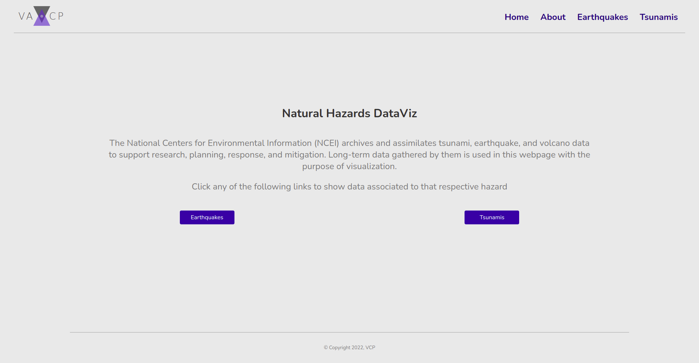

  <h1 align="center">Hazards Data Viz </h1>

The purpose of this repo is to show a bit of React + d3 + Next.js. 

# Getting Started
To build this project, it's as easy as following the next steps, and you'll have a homepage as cute as this one.
<p align="center">

<p/>

## Prerequisites

You should have [Nodejs](https://nodejs.org/en/) and [Git](https://git-scm.com/downloads) installed on your PC. You should also own a GitHub account.

## Setup

1. Clone this repository to your local machine.
    ```sh
      git clone https://github.com/vicente-cp/hazards-data-viz.git
    ``` 
2. (Optional): 
 Edit the [/public/](https://github.com/vicente-cp/hazards-data-viz/tree/main/public) folder to use your own logo and images.

3. Run the following scripts in the terminal to install the respective dependencies.
    ```sh
      npm install
      npm run build
    ```
## Testing

1. To test on your local server, run the following command:
    ```sh
      npm run dev
    ```

2. Open the browser to http://localhost:3000/

3. Profit!